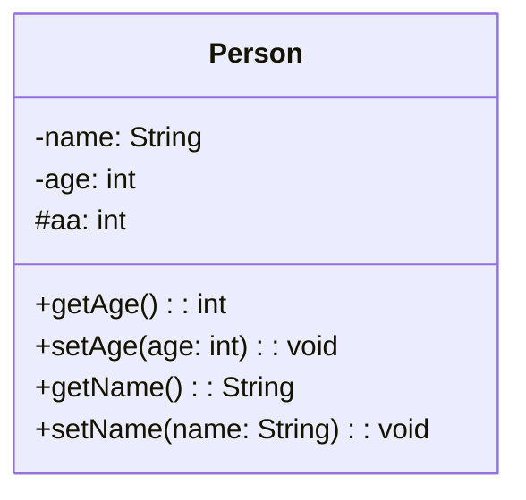
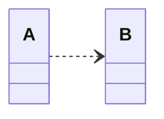
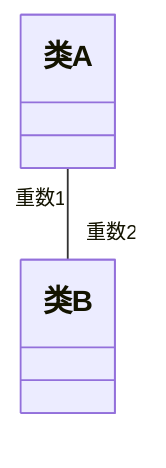
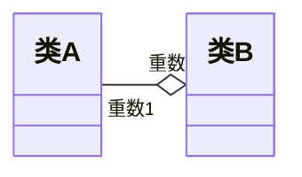
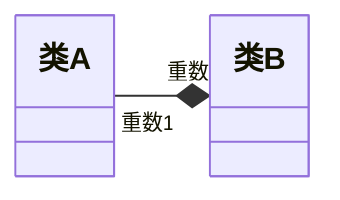
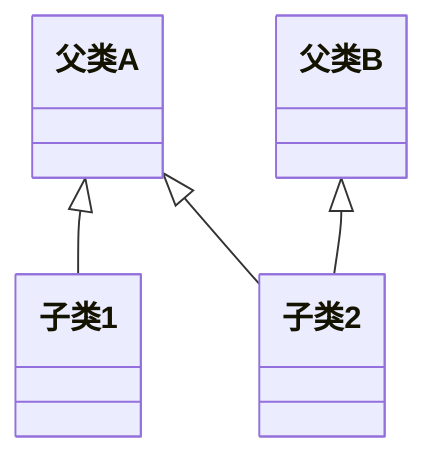

## 绪论

面向对象四个特点：**抽象**、**封装**、**多态**、**继承**
类型大小：byte
- char: 1
- short: 2
- int: 4
- long: 4
- long long: 8
- float: 4
- double: 8
---
## 简单程序设计

#### 常量
常量是固定值，在程序执行期间不会改变。这些固定的值，又叫做**字面量**。
常量可以是任何的基本数据类型，可分为整型数字、浮点数字、字符、字符串和布尔值。
常量就像是常规的变量，只不过常量的值在定义后不能进行修改。

#### 变量
---
## 函数

#### 什么是内联函数？
如果一个函数是内联的，那么在编译时，编译器会把该函数的代码副本放置在每个调用该函数的地方。
对内联函数进行任何修改，都需要重新编译函数的所有客户端，因为编译器需要重新更换一次所有的代码，否则将会继续使用旧的函数。
如果想把一个函数定义为内联函数，则需要在函数名前面放置关键字 **inline**，在调用函数之前需要对函数进行定义。如果已定义的函数多于一行，编译器会忽略 inline 限定符。
- inline仅是一个对编译器的建议
- inline 只适合涵数体内代码简单的涵数使用，不能包含复杂的结构控制语句例如 while、switch，并且不能内联函数本身不能是直接递归函数
- 仅在定义时添加**inline**才可用，声明添加无效

### 类中的成员函数与inline
**定义**在类中的**成员函数**默认都是**内联的**，如果在类定义时就在类内给出函数定义，那当然最好。如果在类中未给出成员函数定义，而又想内联该函数的话，那在类外要加上 inline，否则就认为不是内联的。

### 函数重载
在同一个作用域内，可以声明几个功能类似的同名函数，但是这些同名函数的形式参数（指参数的个数、类型、顺序或者是否为常量 **const**）必须不同。您不能仅通过返回类型的不同来重载函数。

---
## 类与对象
#### 面向对象的基本特点

**抽象**：是指对于具体问题（对象）机型概括，抽出一类对象的公共性质并加以描述的过程。
	主要分为**数据抽象**和**行为抽象**（或称*功能抽象*、*代码抽象*）分别表示为变量名的命名及函数名的命名

**封装**：将抽象得到的数据和行为（或功能）相结合，形成一个有机整体，也就是将数据与操作数据分的函数代码进行有机结合，形成**类**，其中**数据**和**函数**都是类的成员

**继承**：允许在原有类的特性之上，进行更具体、更详细的说明

**多态**：是指一段程序能处理多种数据类型的能力可能通过强制多态、重载多态、类型参数化多态、包含多态来实现

#### 构造函数与析构函数

**默认构造函数**：调用时无需提供参数的构造函数，若类中没有定义则编译器会生成一个隐含的默认构造函数（参数和函数体皆为空）

**委托构造函数**：委托同类型的另一个构造函数对对象进行初始化。
比如
```c++
class Clock{
public:
	Clock(int a,int b,int c){}
	Clock(): Clock(0,0,0){}      //委托构造函数
}
```

**复制构造函数**：其形参是本类的一个**引用**，作用是使用一个已经存在过的对象，去初始化同类的一个新对象，
- 如果程序员没有为类声明拷贝初始化构造函数，则编译器自己生成一个隐含的复制构造函数。
- 这个构造函数执行的功能是：用作为初始值的对象的每个数据成员的值，初始化将要建立的对象的对应数据成员。
比如
```c++
#include<iostream>

class Point{
public:
	Point(int xx=0,int yy=0):x(xx),y(yy){}
	void display() { cout << "x:" << x << ",y:" << y << endl; }
	Point(Point& p) :x(p.x), y(p.y) { cout << "point reconstrcted" << endl; }
private:
    int x, y;
};

void display(Point p) { p.display(); }
Point build(int x, int y) { Point a(x, y); return a; }

int main() {
    Point a(1, 2);
    a.display();
    Point b(a);        //调用复制构造
    Point c = a;       //调用复制构造
	display(a);        //调用复制构造
	build(1, 2);       //调用复制构造
}
```
当不希望对象被复制构造时
- C++98做法：将复制构造函数声明为private，并且不提供函数的实现。
- C++11做法：用“=delete”指示编译器不生成默认复制构造函数。

**析构函数**：用来完成对象被删除前的一些清理工作，在对象生命周期即将结束时调用，且不接受任何函数，如果程序中未声明析构函数，编译器将自动产生一个默认的析构函数，其函数体为空。

#### UML图形表示

##### UML有三个基本的部分

- 事物（Things）  
	UML中重要的组成部分，在模型中属于最静态的部分，代表概念上的或物理上的元素

- 关系（Relationships）  
	关系把事物紧密联系在一起

- 图（Diagrams）  
	图是很多有相互相关的事物的组

以下是一个简单的 UML 类图的 Markdown 示例：


##### 几种关系表示

##### **依赖关系**

图中的“类A”是源，“类B”是目标，表示“类A”使用了“类B”，或称“类A”依赖“类B”

##### 作用关系——关联

图中的“重数A”决定了类B的每个对象与类A的多少个对象发生作用，同样“重数B”决定了类A的每个对象与类B的多少个对象发生作用。

###### 包含关系——聚集和组合

**共享聚集**：部分可以参加多个整体

**组成聚集(组合)**：整体拥有各个部分，整体与部分共存，如果整体不存在了，那么部分也就不存在了。

**继承关系——泛化**


#### 联合体和结构体
###### 结构体
与类的唯一区别，结构体和类具有不同的默认访问控制属性
###### 联合体
访问控制属性与结构体相同，但全部数据成员共享一组内存单元
#### 小结
- **主要内容**
	- 面向对象的基本概念、类和对象的声明、构造函数、析构函数、内联成员函数、复制构造函数、类的组合
- **达到的目标**
	- 掌握面向对象的基本概念；
	- 掌握类设计的思想、类和对象声明的语法；
	- 理解构造函数、复制构造函数和析构函数的作用和调用过程，掌握相关的语法；
	- 理解内联成员函数的作用，掌握相关语法；
	- 理解类的组合在面向对象设计中的意义，掌握类组合的语法。


---
## 对象的生存期
```c++
#include <iostream>
using namespace std;
int i = 1;	// i 为全局变量，具有静态生存期

void other() {
    //a, b为静态局部变量，具有全局寿命，局部可见，只第一次进入函数时被初始化
    static int a = 2;
    static int b;
    //c为局部变量，具有动态生存期，每次进入函数时都初始化
    int c = 10;
    a += 2;
    i += 32;
    c += 5;
    cout << "---OTHER---" << endl;
    cout << " i: " << i << " a: " << a << " b: " << b << " c: " << c << endl;
    b = a;
}

int main() {
    //a为静态局部变量，具有全局寿命，局部可见
    static int a;
    //b, c为局部变量，具有动态生存期
    int b = -10;
    int c = 0;

    cout << "---MAIN---" << endl;
    cout << " i: " << i << " a: " << a << " b: " << b << " c: " << c << endl;
    c += 8;
    other();
    cout << "---MAIN---" << endl;
    cout << " i: " << i << " a: " << a << " b: " << b << " c: " << c << endl;
    i += 10;
    other();
    return 0;
}
```
### 友元
- 友元是C++提供的一种破坏数据封装和数据隐藏的机制。
- 通过将一个模块声明为另一个模块的友元，一个模块能够引用到另一个模块中本是被隐藏的信息。
- 可以使用友元函数和友元类。
- 为了确保数据的完整性，及数据封装与隐藏的原则，建议尽量不使用或少使用友元。
#### 友元函数
- 友元函数是在类声明中由关键字friend修饰说明的非成员函数，在它的函数体中能够通过对象名访问 private 和 protected成员
- 作用：增加灵活性，使程序员可以在封装和快速性方面做合理选择。
- 访问对象中的成员必须通过对象名。
#### 友元类
- 若一个类为另一个类的友元，则此类的所有成员都能访问对方类的私有成员。
- 声明语法：将友元类名在另一个类中使用friend修饰说明。
- 是单向的：如果声明B类是A类的友元，B类的成员函数就可以访问A类的私有和保护数据，但A类的成员函数却不能访问B类的私有、保护数据。
### 常引用
- 如果在声明引用时用const修饰，被声明的引用就是常引用。
- 常引用所引用的对象不能被更新。
- 如果用常引用做形参，便不会意外地发生对实参的更改。常引用的声明形式如下：
```c++
const 类型说明符 &引用名;
```

---
## 数组、指针、指针常量
### 数组
- **数组**是具有一定==顺序关系==的若干==相同类型变量的集合体==，组成数组的变量称为该数组的==元素==。
### 指针
- 指针：内存地址，用于间接访问内存单元
- 指针变量：用于存放地址的变量
#### 常指针
```c++
const TYPE* var;
```
**指向常量的指针**，指针可变，指向的值不可变

#### 指针常量
```c++
TYPE* const var;
```
**指针本身是常量**，指针不可变，指向的值可变
### 动态内存分配
```c++
new 类型名T(初始化参数)
```
- 功能：
	- 在程序执行期间，申请用于存放T类型对象的内存空间，并依初始化参数进行初始化。
	- 基本类型初始化：如果有初始化参数，依初始化参数进行初始化；如果没有括号和初始化参数，不进行初始化，新分配的内存中内容不确定；如果有括号但初始化参数为空，初始化为0。
	- 对象类型：如果有初始化参数，以初始化参数中的值为参数调用构造函数进行初始化；如果没有括号和初始化参数或者有括号但初始化参数为空，用默认构造函数初始化。
- 结果值：成功：T类型的指针，指向新分配的内存；失败：抛出异常。

### vector对象使用
- 对数组元素的引用
	- 与普通数组具有相同形式：
		- vector对象名 [ 下标表达式 ]
	- vector数组对象名不表示数组首地址
- 获得数组长度
	- 用size函数
		- `数组对象名.size()`
#### vector应用举例
```c++
#include <vector>
int main()
{
    std::vector<int> v = {1,2,3};
    for(auto i = v.begin(); i != v.end(); ++i)
        std::cout << *i << std::endl;
    for(auto e : v)
        std::cout << e << std::endl;
}
```